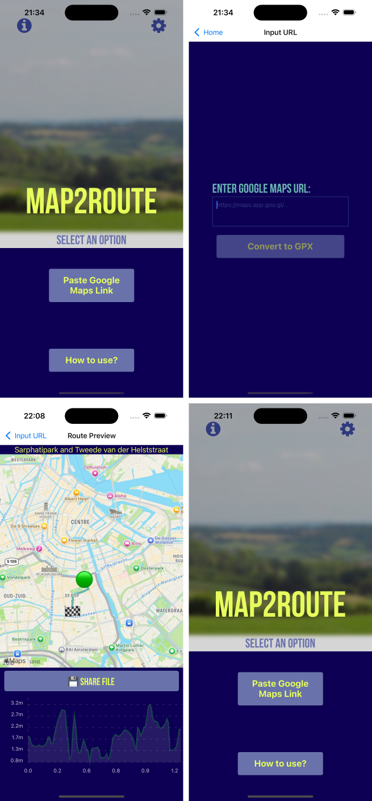

<div align="center">
 


<a href="https://apps.apple.com/app/map2route/id6738019894"></a>
<a href="https://play.google.com/store/apps/details?id=com.pelmers.map2route"></a>

# [Maps2Route](blog link here)

</div>

### The _easy_ way to turn a Google Maps directions link into a routable GPX file!

## Examples



_above:_ **App screens**

## Development

This app is written in React Native using the [Expo](https://expo.io/) framework.

- `yarn ios` to run in the iOS simulator
- `yarn android` to run in the Android emulator

> To show maps on Android, you need a Google Maps API key.
> Create a file named `src/googleApiKey.js` with the line `module.exports = 'your_key_here'`.

**Code**:
Look at [src/App.tsx](src/App.tsx) for the main app entrypoint.
All screens are contained in [src/screens](src/screens), and other UI components are in [src/components](src/components).

## Production Builds

```
eas build -p ios --profile production [--local]
eas build -p android --profile production [--local]
```
